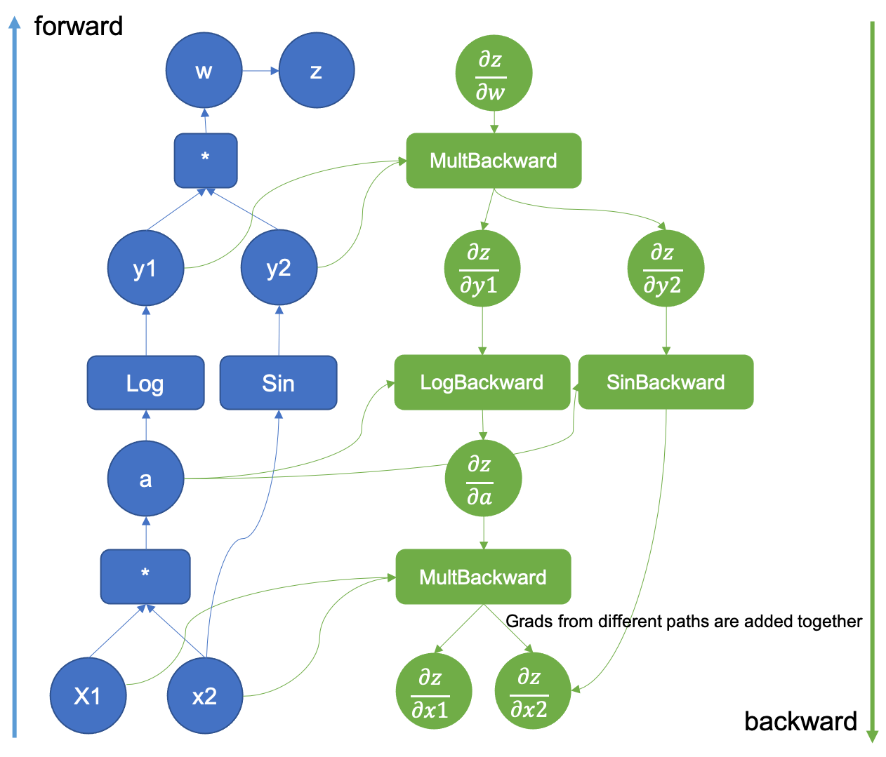

# Autograd: Automatic differentiation library

This library provides a simple implementation for comuting the gradient in the neural network using the method called autodiff. 
Autodiff in this library uses Directed Acyclic Graph (DAG), the so called computational graphs.

# Computational Graph

Computational graphs are a type of graph that can be used to represent mathematical expressions. This is similar to descriptive language in the case of deep learning models, providing a functional description of the required computation.
In general, the computational graph is a directed graph that is used for expressing and evaluating mathematical expressions. 

These can be used for two different types of calculations:

1.) Forward computation
2.) Backward computation

The following sections define a few key terminologies in computational graphs.

a) A variable is represented by a node in a graph. It could be a scalar, vector, matrix, tensor, or even another type of variable.

b) A function argument and data dependency are both represented by an edge. These are similar to node pointers.

c) A simple function of one or more variables is called an operation. There is a set of operations that are permitted. Functions that are more complex than these operations in this set can be represented by combining multiple operations.

Fig. Computational graph [source: Pytorch]
